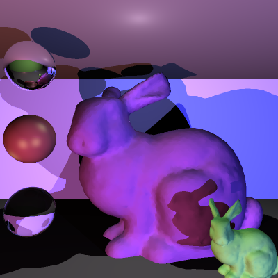

# COMP30019 - Project 1 - Ray Tracer

This is your README.md... you should write anything relevant to your
implementation here.

Please ensure your student details are specified below (*exactly* as on UniMelb
records):

**Name:** Benjamin Cheng-Hsien Yi \
**Student Number:** 1152795 \
**Username:** benjaminchen \
**Email:** benjaminchen@student.unimelb.edu.au

## Completed stages

Tick the stages bellow that you have completed so we know what to mark (by
editing README.md). **At most 9** marks can be chosen in total for stage
three. If you complete more than this many marks, pick your best one(s) to be
marked!

<!---
Tip: To tick, place an x between the square brackes [ ], like so: [x]
-->

##### Stage 1

- [x] Stage 1.1 - Familiarise yourself with the template
- [x] Stage 1.2 - Implement vector mathematics
- [x] Stage 1.3 - Fire a ray for each pixel
- [x] Stage 1.4 - Calculate ray-entity intersections
- [x] Stage 1.5 - Output primitives as solid colours

##### Stage 2

- [x] Stage 2.1 - Diffuse materials
- [x] Stage 2.2 - Shadow rays
- [x] Stage 2.3 - Reflective materials
- [x] Stage 2.4 - Refractive materials
- [x] Stage 2.5 - The Fresnel effect
- [x] Stage 2.6 - Anti-aliasing

##### Stage 3

- [ ] Option A - Emissive materials (+6)
- [ ] Option B - Ambient lighting/occlusion (+6)
- [x] Option C - OBJ models (+6)
- [x] Option D - Glossy materials (+3)
- [ ] Option E - Custom camera orientation (+3)
- [ ] Option F - Beer's law (+3)
- [ ] Option G - Depth of field (+3)

*Please summarise your approach(es) to stage 3 here.*
##### OBJ models
The obj file was read in and transformed into triangles.

The bounding box of the entire object was split into multiple
bounding boxes (64 for final scene) each representing a section
of the original bounding box. Each smaller bounding box was adjusted
in size to wholly contain all triangles intersecting it, and empty
bounding boxes were culled. When checking for triangle ray intersections,
each bounding box is checked for intersection first (in parallel), then
for each bounding box intersecting with the ray, all triangles inside
that bounding box was checked for intersection (in parallel).

Triangle normals were interpolated by distance from vertices when calculating
for refraction and reflection rays.
##### Glossy materials
Glossy materials derive their color from a mixture of diffraction and reflection.

Half the color comes from diffraction which is calculated as in previous section.
Half the color comes from reflection, which is calculated from a weighted sum of
reflected rays from light sources to the camera. An approximation of the Phong
reflection model was used to calculated weights.
## Final scene render

Be sure to replace ```/images/final_scene.png``` with your final render so it
shows up here.



This render took **8** minutes and **35** seconds on my PC.

I used the following command to render the image exactly as shown:

```
dotnet run -- -w 400 -h 400 -f tests/final_scene.txt -o images/final_scene.png -x 2
```

## Sample outputs

We have provided you with some sample tests located at ```/tests/*```. So you
have some point of comparison, here are the outputs our ray tracer solution
produces for given command line inputs (for the first two stages, left and right
respectively):

###### Sample 1

```
dotnet run -- -f tests/sample_scene_1.txt -o images/sample_scene_1.png -x 4
```

<p float="left">
  
   
</p>

###### Sample 2

```
dotnet run -- -f tests/sample_scene_2.txt -o images/sample_scene_2.png -x 4
```

<p float="left">
  
   
</p>

## References

Schlick approximation to Fresnel equation
https://blog.demofox.org/2017/01/09/raytracing-reflection-refraction-fresnel-total-internal-reflection-and-beers-law/

Reflection vector math
https://math.stackexchange.com/a/13263

Phong reflection model math
https://en.wikipedia.org/wiki/Phong_reflection_model

Copying a stack in C#
https://stackoverflow.com/a/7391388

Refraction vector math
https://physics.stackexchange.com/a/436252

Sphere intersection math
https://www.scratchapixel.com/lessons/3d-basic-rendering/minimal-ray-tracer-rendering-simple-shapes/ray-sphere-intersection